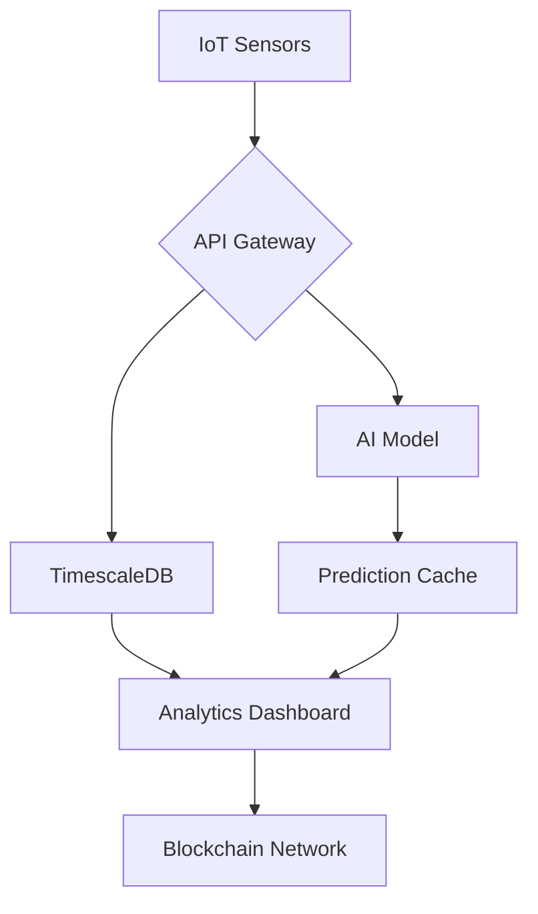

# System Architecture

## High-Level Overview


## Component Breakdown
1. IoT Sensors
- Energy Monitoring: ESP32 + Current Sensors
- Water Flow Monitoring: YF-S201 Sensors
- Environmental Sensors: BME680 (Air Quality)

2. Backend Services
```MERMAID
sequenceDiagram
    Sensor->>API: HTTP POST /sensors/data
    API->>Database: Store raw data
    API->>AI Engine: Trigger prediction
    AI Engine->>Database: Get historical data
    AI Engine->>API: Return forecast
    API->>Blockchain: Record carbon credits
```
3. Data Pipeline
- Raw Sensor Collection (1s intervals)
- Data Validation & Cleaning
- TimescaleDB Hypertable Storage
- Batch Processing (Nightly Aggregates)
- ML Feature Engineering
- Prediction Serving

## Key Features
- Real-time data ingestion (10k+ events/sec)
- 7-day rolling predictions using LSTM
- Automated anomaly detection
- Blockchain-backed audit trails


## Design Considerations
- Data Retention: 1 year raw data, 5 years aggregates
-  Security: TLS 1.3 for all sensor communications
- Scalability: Kubernetes-ready deployment
-Compliance: GDPR-ready data handling

