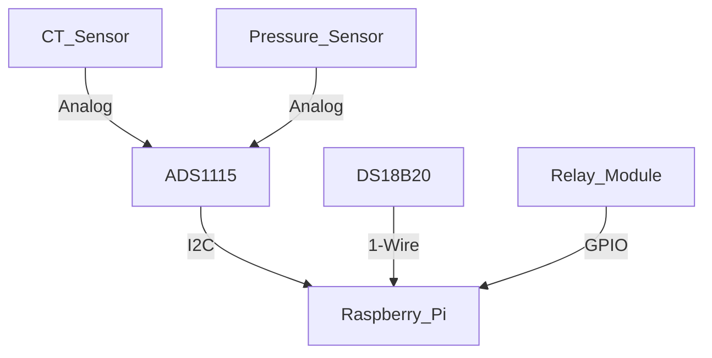

# Industrial IoT Sensor Setup Guide

## Required Components
- Raspberry Pi 4 Model B
- ADS1115 16-bit ADC
- Current Transformer (CT) Sensor SCT-013-000
- Pressure Transducer (0-10 bar)
- DS18B20 Temperature Sensor
- 4-Channel Relay Module

## Wiring Diagram

## Pin Configuration
Sensor	Raspberry Pi Pin	Notes
ADS1115 SDA	GPIO 2	I2C Data
ADS1115 SCL	GPIO 3	I2C Clock
DS18B20 Data	GPIO 4	4.7KΩ pull-up resistor
Relay Channel 1	GPIO 17	Main power control
Relay Channel 2	GPIO 27	Water valve control

## Calibration Procedure
Current Sensor: 
```
# Zero offset calibration
samples = [read_ct() for _ in range(1000)]
zero_offset = sum(samples) / len(samples)
```
Pressure Sensor:
```
curl -X POST http://sensor-api/calibrate -d '{"type":"pressure","zero_point":0.5}'
```
## Safety Precautions
Use 3.3V logic level only
Install 30mA RCD protection
Maintain 0.5m separation from high-voltage lines
Ground all metal sensor enclosures

## Troubleshooting
No Sensor Data:
Check I2C detection: i2cdetect -y 1
Verify 3.3V power supply
Test with minimal configuration
Inaccurate Readings:
Re-run calibration sequence
Check for electromagnetic interference
Verify sensor grounding


**2. File Location:** `EcoTrack/sensors/mock_sensors/sensor_simulator.py`
```
Advanced Sensor Simulator for Development
```
Features:
- REST API for fake sensor data
- Adjustable noise levels
- Failure scenario simulation
- Historical data generation
- Multiple sensor types
- Rate limiting
"""


